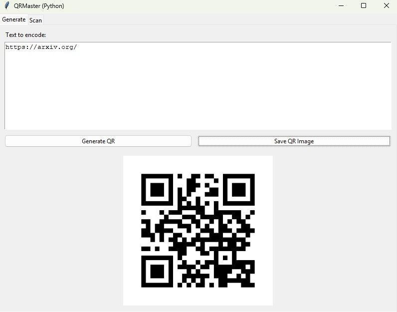

# QRMaster (Python Desktop App)
One day I needed to generate QR code for my personal webpage, so I used a commercial website to do it. It needs registration but it is free. Then couple of days later, QR code was expired and that website sent me ad emails. So annoying. 

QRMaster is a **Python based desktop application**.
It lets you:
- Generate QR codes from arbitrary text and save them as PNG images.
- Scan QR codes using your computer's webcam and read the decoded content.
## Requirements
- Python 3.9+ (recommended)
- pip
Install dependencies:
```bash
pip install -r requirements.txt
```
## Run the app
From the project root:
```bash
python main.py
```
This opens a window with two tabs:

- **Generate**: Type text, click **Generate QR**, then optionally **Save QR Image**.
- **Scan**: Click **Start Camera Scan**; a camera window opens and will detect and decode the first QR code it sees.

## Interface




